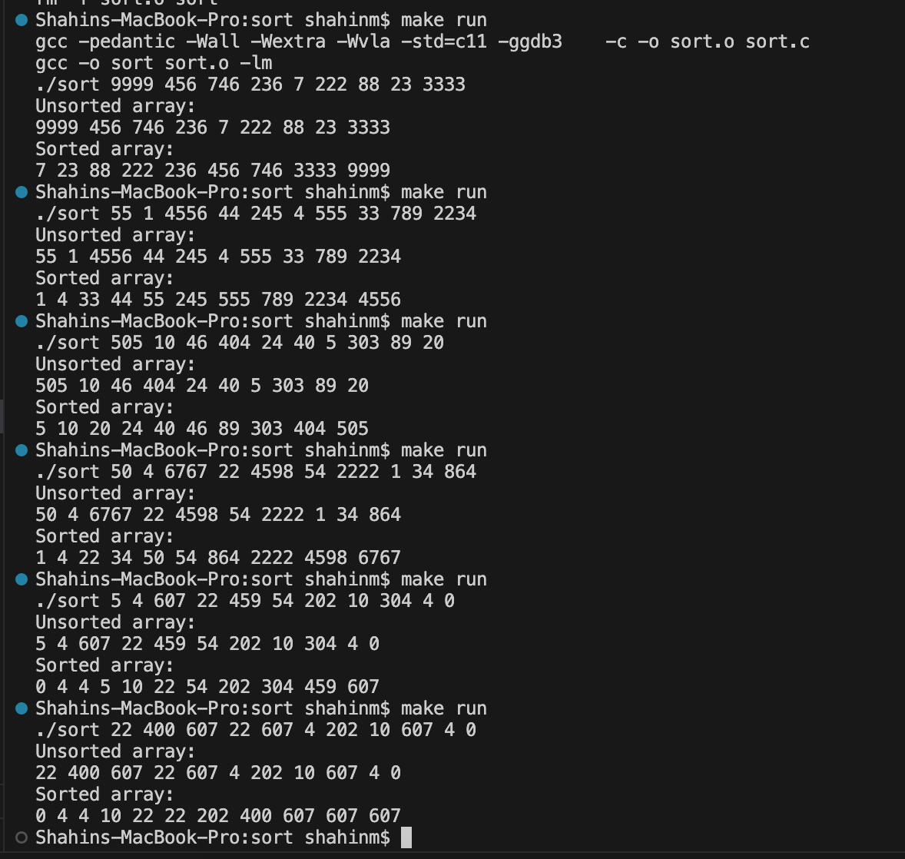
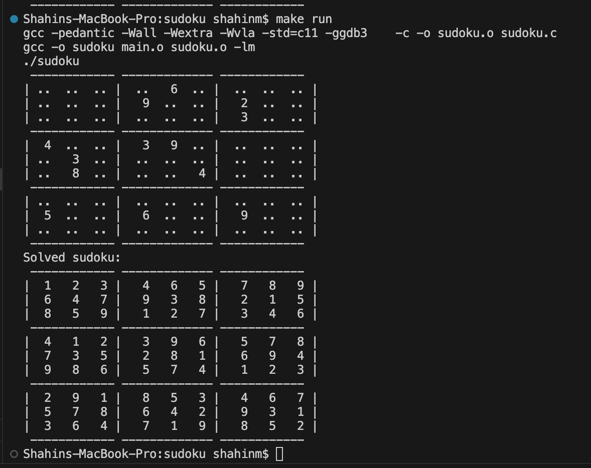
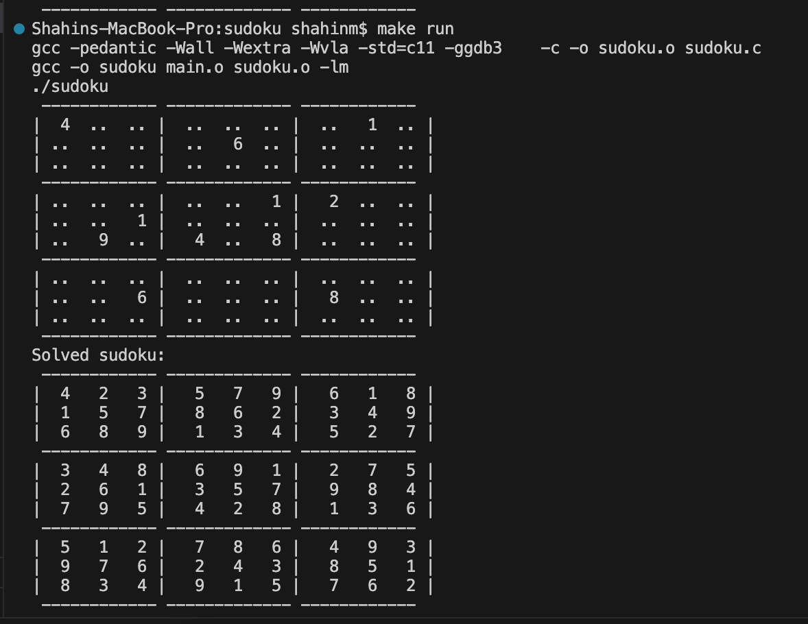
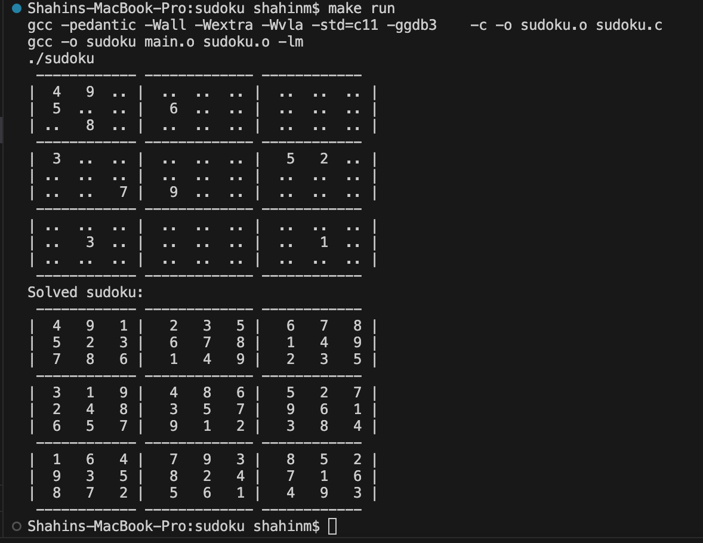
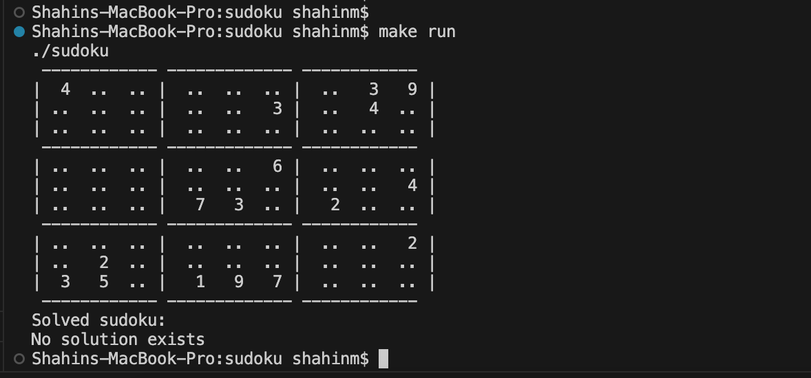
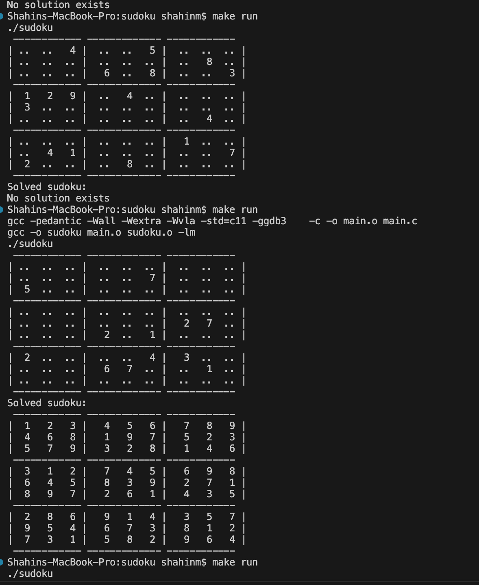
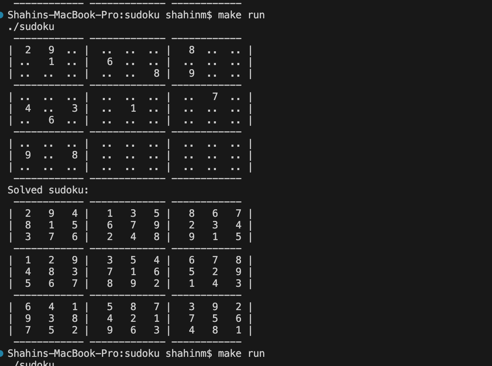
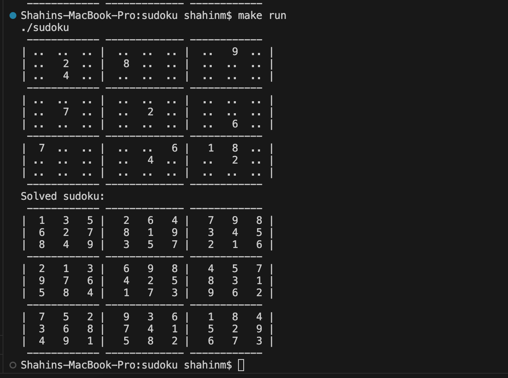

# Übung 2 - Lösung

## 1. Sortieren ganzer Zahlen (src/sort/)

### Lösungsidee
in Function main wird Werte für Array von argv gelesen, gespeichert und die aktuelle Anzahl von Elementen gespeichert.
1. Function MergeSort
In diesem Function wird Function merge_sort_recursive aufgerufen und die begin und End index als parameter gegeben.
2. Function merge_sort_recursive
Array wird erstmal in der Mitte in zwei Teile zerteilt. Für beide Seiten wird dann die Methode rekursive ausgeführt bis nur noch ein Element in einer Menge vorhanden ist. Dann funktioniert Function merge.
3. Function merge
In diesem Function wird mit der Verschmelzung begonnen. Dabei werden immer zwei benachbarte Teile miteinander verbunden und dabei direkt sortiert. Zuerst wird temporary Array benutzt und danach von temporary Array zu main Array kopiert.

### Implementierung
Ich habe für 1 kein Konstant genommen, weil in 1. semester der Tutor mir Feedback gegeben hat, dass für 1 man kein Konstant braucht.
siehe code

### Tests

## 2. Mini-Sudoku Solver & Generator (src/sudoku/) 

### Lösungsidee
Zuerst wird ein 2D array definiert. 
a. Function mark_board
    Mit diesem Function kann einzelne Positionen per Koordinaten gesetzt werden. 
    Function print
    Diese Function gibt Array aus.
b. Function is_valid
    Mit diesem Function wird überprüft ob die gegebene Stelle (noch) gültig ist. Zuerst wird mit einer Schleife gerpüft ob in gegebenen Zeile und Spalte als parameter gegebene Zahl gibt oder nicht. Wenn ja, dann Function liefert false und mit break hört auf weiterzusuchen. Wenn diese Zahl in gleichen Zeile oder Spalte nicht gibt, dann funktioniert Function is_block_valid und wird geprüft ob diese Zahl in 3×3-Teilfeld gibt oder nicht. Wenn ja, dann Function liefert false und mit break hört auf weiterzusuchen. Wenn diese Zahl in 3×3-Teilfeld nicht gibt, dann wird geprüft ob diese Stelle gültig ist.
c. Function solve_sudoku
    Zuerst wird geprüft ob letzte index von Array ist oder nicht, um weiter nicht suchen. Wenn Spalten index 9 ist, dann wird zur nächsten Zeile geschaut und Spalte beginnt bei 0. Wenn in diesem koordinaten nicht gültig(0) ist, dann wird diese Function rekursive aufgerufen (Die Zahl von spalten wird erhöht). Mit einer Schleife wird alle Zahlen zwischen 1 und 9 geprüft ob in gefundene position passen oder nicht(Function is_valid). Wenn Function is_valid true liefert, dann wird diese Zahl speichern. am Ende wird die Belegung der Position wieder zurückgenommen.
d. Function initialize_board
    Mit diesem Function wird Array „zufällig“ mit 10 bis 20 Zahlen initialisiert. Zufällige Zahlen(für Koordinaten und die Zahl zu speichern) werden mit Hilfe der Funktion rand() erhalten. Mit Hilfe Function is_valid wird gültige Stelle gefunden. 

### Implementierung
siehe code

### Tests

